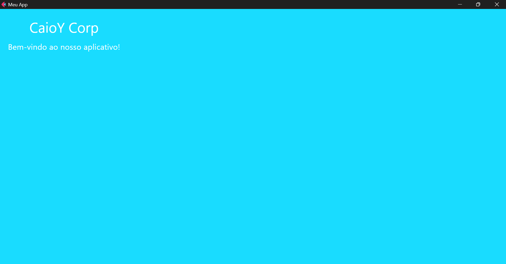
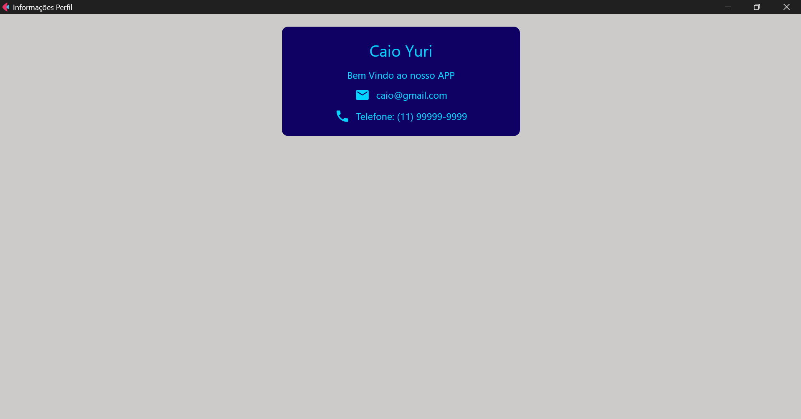
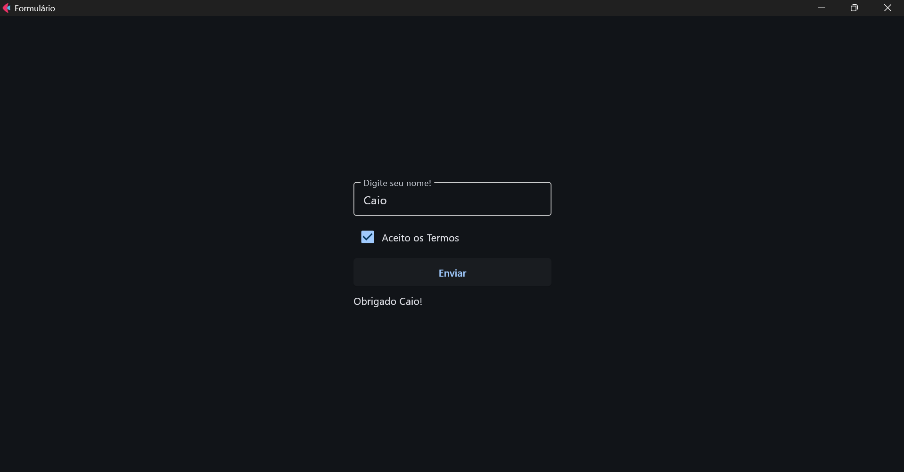
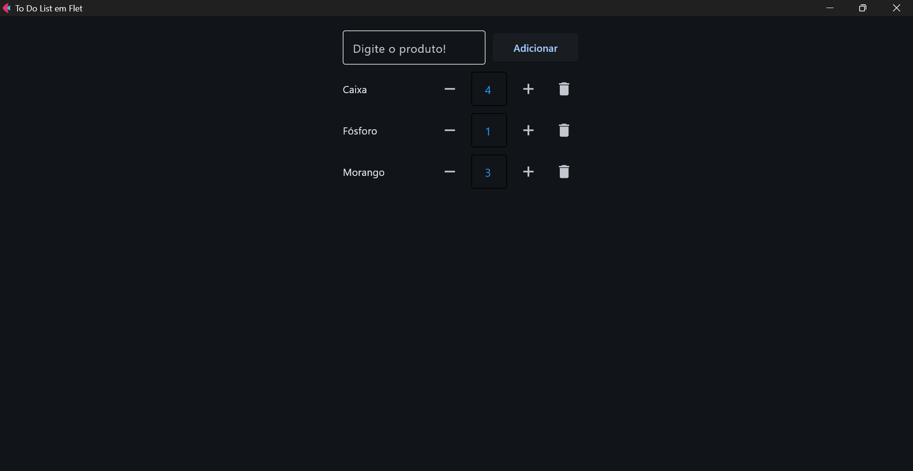

# Exercícios Flet com Python

Repositório destinado à postagem de exercícios e projetos desenvolvidos durante o aprendizado de **Flet com Python**.

O objetivo é praticar a criação de interfaces gráficas, componentes, eventos e funcionalidades utilizando Python para o desenvolvimento de aplicações.

## Tecnologias

- Python
- Flet

## Telas

